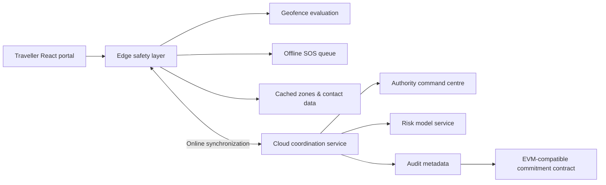

# Architecture

## Intent

The system follows an **offline-first edge–cloud architecture**. Immediate safety decisions are made locally where delay is most harmful, while coordination, history, analytics, and controlled audit anchoring belong to the cloud and integrity layers. The source package uses local state to make every path demonstrable without service credentials; its service boundaries are intentionally named so they can be exchanged for backend procedures without rebuilding the UI.



## Local domain model

| Entity | Important fields | Purpose |
|---|---|---|
| `RiskZone` | centre, radius, risk score, band, factors | Supports map overlays and edge geofence checks. |
| `Incident` | ID, type, status, location, risk, responder, audit history | Represents an SOS through the full lifecycle. |
| `AuditEntry` | actor, action, timestamp, detail, optional hash | Provides a chronological operational record. |
| `EmergencyContact` | name, phone, relationship, primary | Keeps emergency contacts available in local safety state. |
| `TravelProfile` | tourist ID, travel detail, verification status | Creates the digital identity representation. |

## Incident lifecycle

The local safety service enforces a deliberate state machine:

```text
CREATED → VERIFIED → ASSIGNED → RESPONDING → RESOLVED
```

Every valid transition appends a timestamped audit event with an actor and contextual detail. The authority queue drives the same underlying transition service displayed in the traveller’s incident tracker. A closed case can then receive a hash commitment without blocking the primary operational state.

## Production replacement points

| Prototype boundary | Production implementation |
|---|---|
| `SafetyContext` local state | Authorized database queries and mutations with optimistic client updates. |
| Browser local storage | IndexedDB with encrypted/appropriate device storage and synchronization metadata. |
| Synthetic zone seed data | Governed geographic data stream with versioned safety-zone records. |
| Local role selector | Authenticated sessions and server-side RBAC checks. |
| Audit simulation | Transaction service using a managed signer, transaction receipt storage, and verification job. |

The scaffold already provides a typed server and database foundation. A production migration should preserve the client service contracts while moving operational records behind protected procedures and a durable database schema.
