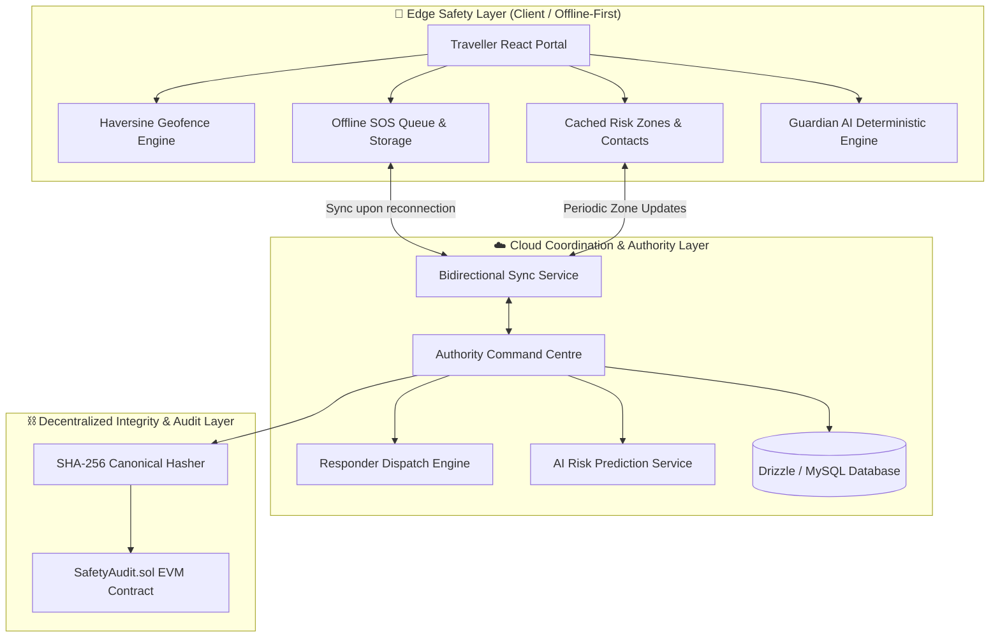

# 🛡️ Suraksha Link (सुरक्षा लिंक) — Smart Tourist Safety Portal

<div align="center">


<br/>

**A Next-Generation Offline-First Tourist Safety Monitoring, Incident Dispatch, Contextual AI Risk Assessment, & Blockchain-Anchored Audit System.**

[Key Features](#-key-features) • [System Architecture](#-system-architecture) • [Pan-India Coverage](#-pan-india-36-states--uts-matrix) • [Tech Stack](#-technology-stack) • [Quickstart](#-getting-started) • [Demo Script](#-jury-demonstration-script)

---

</div>

## 📌 Table of Contents

- [Overview & Vision](#-overview--vision)
- [Key Features](#-key-features)
  - [Traveller Safety Portal (Tourist Hub)](#1-traveller-safety-portal-tourist-hub)
  - [Authority Command & Control Centre](#2-authority-command--control-centre)
  - [Pan-India Multi-Territory Support](#3-pan-india-multi-territory-support)
  - [Explainable AI Risk Engine & Guardian AI](#4-explainable-ai-risk-engine--guardian-ai)
  - [Privacy-Preserving Blockchain Audit Layer](#5-privacy-preserving-blockchain-audit-layer)
- [System Architecture](#-system-architecture)
  - [Edge vs Cloud Availability Matrix](#edge-vs-cloud-availability-matrix)
  - [Incident State Machine](#incident-state-machine)
- [Solidity Smart Contract (`SafetyAudit.sol`)](#-smart-contract-specification)
- [Technology Stack](#-technology-stack)
- [Project Directory Structure](#-project-directory-structure)
- [Getting Started & Local Installation](#-getting-started)
- [Running Tests & Quality Assurance](#-running-tests--qa)
- [Jury Demonstration Script (Step-by-Step)](#-jury-demonstration-script)
- [Privacy, Security & Ethical AI Posture](#-security-privacy--ethical-ai-posture)
- [Future Roadmap](#-future-production-roadmap)
- [License](#-license)

---

## 🌟 Overview & Vision

**Suraksha Link** is an end-to-end tourist safety coordination platform built to protect domestic and international travelers across India. Designed to overcome critical challenges in remote areas—such as erratic cellular connectivity, language barriers, fragmented emergency response units, and unverified incidents—Suraksha Link delivers a dual-portal solution:

1. **Traveller Safety Portal**: An offline-first web companion empowering tourists with 1-tap SOS broadcasting, cached risk zones, on-device geofencing, state-specific emergency directories, time-bound location sharing, and a context-aware Guardian AI advisor.
2. **Authority Command Centre**: A role-gated administrative suite for law enforcement and emergency responders, providing real-time incident queues, one-click unit dispatch with ETA computation, explainable AI risk heatmaps, digital identity verification, and tamper-evident blockchain audit logging.

> 🛡️ **Prototype Integrity & Transparency:** All map zones, telemetry feeds, risk-model inputs, and incident histories included in the repository are synthetic demonstration seed records. The prototype showcases production-ready architecture, clear interface boundaries, and resilient failover mechanisms.

---

## 🚀 Key Features

### 1. Traveller Safety Portal (Tourist Hub)
- **🚨 1-Tap Instant SOS:** Triggers an immediate emergency alert with real-time GPS coordinates, calculated local risk score, active state context, and incident categorization (Medical, Harassment, Lost, Suspicious Activity).
- **📶 Offline-First SOS Queue:** When internet connectivity is severed, emergency requests and audit events are queued in local persistent storage (`PENDING_SYNC`) and automatically pushed to cloud authority dispatch once connectivity resumes.
- **🗺️ Interactive Geofenced Map:** Displays dynamic **Safe**, **Caution**, and **Danger** zones with client-side Haversine geofence boundary calculations and safer alternate route suggestions.
- **🤖 Guardian AI Safety Companion:** A deterministic, grounded safety assistant that offers localized safety precautions, safe navigation corridors, and emergency instructions based on real-time risk scores and territory parameters.
- **🆔 Verifiable Digital Identity Card:** Displays the tourist's verified credentials, travel dates, accommodation info, and a verifiable cryptographic QR code backed by SHA-256 hash commitments.
- **📍 Live Location Sharing:** User-controlled, time-bound location broadcast with countdown timer and instant revocation controls.
- **👥 Emergency Contacts & Priority Dial:** Manage emergency contacts locally with 1-click direct dialing and SMS dispatch triggers.
- **📋 Incident Tracker:** Real-time visibility into active incident status, assigned responder details, estimated arrival times, and timestamped audit logs.

### 2. Authority Command & Control Centre
- **📊 Real-Time Incident Dispatch Queue:** Centralized dashboard categorizing alerts by severity (`LOW`, `MEDIUM`, `HIGH`, `CRITICAL`) and lifecycle status (`CREATED`, `VERIFIED`, `ASSIGNED`, `RESPONDING`, `RESOLVED`).
- **🚒 Responder Unit Assignment:** Dispatch available response teams (Medical, Police, Rescue) with calculated ETA and real-time operational status updates.
- **🧠 Contextual AI Risk Analytics:** Visual risk breakdown explaining contributing risk factors (historical incident rates, recent incident spikes, severity index, tourist density, and time-of-day exposure).
- **🪪 Identity Verification Registry:** Inspect and verify tourist digital ID commitments against issued cryptographic hashes.
- **⛓️ Blockchain Audit Trail:** Anchors immutable SHA-256 canonical incident data hashes onto EVM-compatible smart contracts upon resolution.
- **🛡️ Admin Oversight & Regional Controls:** Configure jurisdictional boundaries, responder fleets, and safety thresholds across all Indian territories.

### 3. Pan-India Multi-Territory Support
- Complete database covering all **28 States and 8 Union Territories** (36 total administrative divisions).
- Instant switching between states updates local emergency numbers (Tourist Police, State Disaster Management, Women's Helpline, Medical), primary tourist hubs, cultural do's & don'ts, and local risk advisories.

### 4. Explainable AI Risk Engine & Guardian AI
- **Transparent Mathematical Scoring:** Employs an explainable linear-risk model instead of an uninterpretable black box:
  $$\text{Risk Score} = w_1 \cdot \text{HistIncidents} + w_2 \cdot \text{RecentIncidents} + w_3 \cdot \text{Severity} + w_4 \cdot \text{Density} + w_5 \cdot f(\text{Hour}) + w_6 \cdot \text{HistRisk}$$
- **Categorized Risk Bands:** Maps output (0–100) into `SAFE` (0–39), `CAUTION` (40–69), and `DANGER` (70–100) with explainable contributing factors.
- **Deterministic AI Grounding:** Guardian AI delivers immediate, safe, and hallucination-free guidance even in zero-bandwidth environments.

### 5. Privacy-Preserving Blockchain Audit Layer
- **Strict Data Minimization:** Personal identifying info (PII), phone numbers, chat logs, and continuous GPS tracks remain strictly **off-chain**.
- **Immutable Commitments:** Only canonical SHA-256 identity hashes and post-incident resolution hashes are committed to smart contracts for tamper-evident oversight.

---

## 🏗️ System Architecture



### Edge vs Cloud Availability Matrix

| Capability | Edge Device (Offline) | Cloud Server (Online) | Design Justification |
|---|:---:|:---:|---|
| **Immediate SOS Trigger** | ✅ Queued Locally | ✅ Synced to Dispatch | Zero delays in initiating distress alerts. |
| **Geofence Warning** | ✅ Haversine Evaluation | ✅ High-Res Zone Updates | Immediate warnings without cloud latency. |
| **Risk Zone Display** | ✅ Cached Map | ✅ Real-Time Dynamic Map | Map remains navigable in dead zones. |
| **Guardian AI Assistance** | ✅ Grounded Local Mode | ✅ Cloud LLM Enhanced | Critical safety advice never fails offline. |
| **Emergency Contacts** | ✅ On-Device Storage | ✅ Encrypted Cloud Backup | Immediate 1-tap phone calls available. |
| **Responder Dispatch** | ❌ (Queued for Sync) | ✅ Live Authority Queue | Dispatching requires central coordination. |
| **Blockchain Commitments** | ❌ (Deferred) | ✅ EVM Network Submission | Auditing occurs post-resolution. |

### Incident State Machine

```
  ┌─────────┐       ┌──────────┐       ┌──────────┐       ┌────────────┐       ┌──────────┐
  │ CREATED │ ────> │ VERIFIED │ ────> │ ASSIGNED │ ────> │ RESPONDING │ ────> │ RESOLVED │
  └─────────┘       └──────────┘       └──────────┘       └────────────┘       └──────────┘
       │                 │                  │                   │                   │
       ▼                 ▼                  ▼                   ▼                   ▼
  [Local/Cloud]    [Operator Check]   [Unit Selected]     [En Route / ETA]    [Hash Anchored]
```

---

## 📜 Smart Contract Specification

The project includes a reference Solidity smart contract located at `contracts/SafetyAudit.sol` that implements verifiable identity registration and tamper-evident incident recording:

```solidity
// SPDX-License-Identifier: MIT
pragma solidity ^0.8.24;

contract SafetyAudit {
    address public immutable operator;

    struct IdentityCommitment {
        bytes32 identityHash;
        uint64 registeredAt;
        bool verified;
    }

    struct IncidentCommitment {
        bytes32 dataHash;
        uint64 recordedAt;
        bool verified;
    }

    mapping(string => IdentityCommitment) private identities;
    mapping(string => IncidentCommitment) private incidents;

    event IdentityRegistered(string indexed identityId, bytes32 indexed identityHash, uint64 timestamp);
    event IncidentRecorded(string indexed incidentId, bytes32 indexed dataHash, uint64 timestamp);

    function registerIdentity(string calldata identityId, bytes32 identityHash) external onlyOperator;
    function verifyIdentity(string calldata identityId, bytes32 expectedHash) external view returns (bool);
    function recordIncident(string calldata incidentId, bytes32 dataHash) external onlyOperator;
    function verifyIncident(string calldata incidentId, bytes32 expectedHash) external view returns (bool);
}
```

---

## 🗺️ Pan-India 36 States & UTs Matrix

Suraksha Link includes out-of-the-box support for all 36 Indian administrative territories:

| Region Type | Included Territories | Sample Emergency Contacts & Features |
|---|---|---|
| **Northern States & UTs** | Delhi, Jammu & Kashmir, Ladakh, Himachal Pradesh, Punjab, Uttarakhand, Haryana, Uttar Pradesh, Chandigarh | 112 (National), State Disaster Relief Units, Hill Highway Emergency Patrols |
| **Western & Central** | Rajasthan, Gujarat, Maharashtra, Goa, Madhya Pradesh, Chhattisgarh, D&NH and D&D | Coastal Police Helplines, Desert Safari Patrols, Forest Reserve Safety Teams |
| **Southern States & UTs** | Karnataka, Kerala, Tamil Nadu, Andhra Pradesh, Telangana, Puducherry, Lakshadweep, Andaman & Nicobar | Tourist Police Stations, Marine Safety Squads, Mountain Rescue Helplines |
| **Eastern & North-Eastern** | West Bengal, Odisha, Bihar, Jharkhand, Assam, Sikkim, Meghalaya, Arunachal Pradesh, Nagaland, Manipur, Mizoram, Tripura | Border Checkpost Protocols, Monsoon Flood Alert Units, Multi-lingual Helpdesks |

---

## 💻 Technology Stack

### Frontend & UI
- **React 19** & **TypeScript 5.9**: High-performance, type-safe reactive frontend.
- **Vite 7**: Ultra-fast build tooling and hot module replacement.
- **Tailwind CSS v4** & **Radix UI**: Polished modern design system with glassmorphism, responsive navigation, and dark/light themes.
- **Framer Motion**: Fluid state transitions and micro-interactions.
- **Lucide React**: Clean iconography.
- **Wouter**: Lightweight, zero-dependency client routing.
- **Recharts**: Responsive analytics visualizations for incident trends and risk curves.
- **Sonner**: Toast notification system for edge events and sync alerts.

### Backend, Edge & Data Layer
- **Node.js & Express**: API gateway and orchestration server.
- **Drizzle ORM & MySQL2**: Type-safe database queries, schema definitions, and migration tooling.
- **Jose & Nanoid**: Cryptographic token generation and identifier creation.
- **Vitest**: Unit testing for safety calculations, geofencing, and authentication.

### Decentralized Integrity & Contracts
- **Solidity ^0.8.24**: EVM smart contract for hash-based identity and incident auditing.
- **Web Cryptography API (SHA-256)**: Canonical data hashing.

---

## 📁 Project Directory Structure

```text
smart-tourist-safety/
├── client/
│   ├── public/                 # Static assets, icons, and manifests
│   └── src/
│       ├── components/         # Reusable UI widgets, alerts, navigation, theme toggle
│       │   └── ui/             # Radix-based primitives (buttons, modals, cards, tabs)
│       ├── contexts/
│       │   ├── SafetyContext.tsx # Central safety state, offline queue, sync engine
│       │   └── ThemeContext.tsx  # Dark / Light theme provider
│       ├── lib/
│       │   ├── safety-engine.ts  # Haversine distance, risk algorithm, state transitions
│       │   ├── mock-safety-data.ts # Seed records & Pan-India territory datasets
│       │   └── safety-engine.test.ts # Vitest suite for core safety algorithms
│       ├── pages/
│       │   ├── RoleLanding.tsx   # Entry point & role selection portal
│       │   ├── PanIndiaExplorer.tsx # 36 States & UTs interactive explorer
│       │   ├── TouristHome.tsx   # Traveller dashboard & live safety cards
│       │   ├── TouristMap.tsx    # Interactive risk map & geofenced corridors
│       │   ├── TouristSOS.tsx    # 1-tap SOS trigger & offline queue manager
│       │   ├── TouristGuardian.tsx # Grounded Guardian AI assistant
│       │   ├── TouristIdentity.tsx # Digital tourist ID card & QR verifier
│       │   ├── TouristContacts.tsx # Emergency contacts & speed-dial
│       │   ├── TouristLocation.tsx # Time-bound live location sharing
│       │   ├── TouristIncidents.tsx # Active tourist incident tracker
│       │   ├── AuthorityCommand.tsx # Authority central command & dispatch
│       │   ├── AuthorityIncidents.tsx # Incident triage & responder dispatching
│       │   ├── AuthorityRisk.tsx # Predictive risk heatmap & explainable factors
│       │   ├── AuthorityTourists.tsx # Registered tourist verifier
│       │   ├── AuthorityAnalytics.tsx # Incident metrics & trend charts
│       │   ├── AuthorityAudit.tsx # Blockchain audit inspector & hash verifier
│       │   ├── AdminOversight.tsx # System parameters & role administration
│       │   ├── SignIn.tsx & SignUp.tsx # Authentication views
│       │   └── NotFound.tsx      # 404 handler
│       ├── App.tsx             # Application routing & provider setup
│       ├── index.css           # Design tokens, CSS variables, typography
│       └── main.tsx            # React application root
├── contracts/
│   └── SafetyAudit.sol         # Solidity integrity & audit smart contract
├── drizzle/
│   └── schema.ts               # Database schema definition
├── server/
│   ├── _core/                  # Core server setup, middleware, tRPC & routers
│   ├── auth.logout.test.ts     # Auth test suite
│   ├── db.ts                   # Database connection pooling
│   └── routers.ts              # API routes
├── AI_MODEL.md                 # Risk engine documentation & scoring formulas
├── ARCHITECTURE.md             # Full architecture and data-flow specifications
├── BLOCKCHAIN.md               # Blockchain integrity and data minimization policy
├── DEMO.md                     # Expert demonstration walkthrough script
├── EDGE_CLOUD.md               # Edge vs cloud boundary documentation
├── package.json                # Project manifest & dependency definitions
├── tsconfig.json               # TypeScript compiler configuration
└── vite.config.ts              # Vite bundler configuration
```

---

## ⚡ Getting Started

### Prerequisites
- **Node.js**: Version `20.x` or higher installed.
- **pnpm**: Recommended package manager (version `9.x` or `10.x`).

### 1. Clone the Repository
```bash
git clone https://github.com/Adithya2005-spec/smart-tourist-safety.git
cd smart-tourist-safety
```

### 2. Install Dependencies
```bash
pnpm install
```

### 3. Start the Development Server
```bash
pnpm dev
```
Open your browser and navigate to `http://localhost:5173` (or the URL displayed in your terminal).

> 💡 **Zero Setup Required:** No external database, Google Maps API key, OpenAI API key, or live blockchain RPC is mandatory to test the prototype. All services run out-of-the-box using deterministic edge simulations and mock seed data.

---

## 🧪 Running Tests & QA

Verify code quality, core calculations, and test suites with the following commands:

```bash
# Run unit test suites (Vitest)
pnpm test

# Run TypeScript type-checking across the entire codebase
pnpm check

# Build production bundle
pnpm build
```

---

## 🎬 Jury Demonstration Script

Follow this sequence to present Suraksha Link during hackathon evaluations:

| Step | Action | Key Demonstration Highlight |
|---|---|---|
| **1. Role Portal** | Open `/` | Showcase Pan-India coverage, dual-portal entry, and dark/light mode toggle. |
| **2. Pan-India Explorer** | Navigate to `/pan-india` | Select different states (e.g., Goa, Himachal Pradesh, Kerala) and show dynamic emergency numbers & local guidelines. |
| **3. Traveller Dashboard** | Enter Traveller Portal (`/tourist`) | Review real-time contextual risk score, active zone advisory, and quick-action shortcuts. |
| **4. Safety Map & Geofencing** | Navigate to `/tourist/map` | Demonstrate Safe, Caution, and Danger geofences with Haversine distance computations and alternate routes. |
| **5. Trigger SOS (Offline Simulation)** | Go to `/tourist/sos` | Trigger an SOS incident. Toggle offline mode to show the event queuing in local storage (`PENDING_SYNC`). Toggle online to demonstrate auto-sync. |
| **6. Guardian AI** | Open `/tourist/guardian` | Ask the Guardian AI for safe exit routes or emergency guidelines. Note deterministic, hallucination-free advice. |
| **7. Authority Command Centre** | Switch to Authority (`/authority`) | View the incoming SOS alert in the live incident queue. |
| **8. Dispatch Responder** | In `/authority/incidents` | Assign a responder unit (e.g., Tourist Police patrol), step through status transitions (`VERIFIED` → `ASSIGNED` → `RESPONDING` → `RESOLVED`). |
| **9. Blockchain Audit Commitment** | Open `/authority/audit` | Inspect the resolved incident's cryptographic SHA-256 commitment hash and verified smart contract state. |

---

## 🔒 Security, Privacy & Ethical AI Posture

1. **Zero Client-Side Secrets:** No sensitive private keys, database passwords, or operational secrets are bundled in the frontend client.
2. **Data Minimization Principle:** Only cryptographic hashes are written to the blockchain audit layer. Personally Identifiable Information (PII), phone numbers, travel itineraries, and raw GPS tracks remain strictly off-chain.
3. **User-Controlled Telemetry:** Live location tracking is explicitly opt-in with user-defined expiration windows and instant revoke capabilities.
4. **Explainable AI:** Risk scoring does not rely on opaque predictions; all score factors are transparently weighted and explained to both the traveler and the authority.

---

## 🔮 Future Production Roadmap

- [ ] **Native Mobile Shell:** Wrap the edge layer in React Native / Capacitor with background geofence services and SMS-fallback SOS.
- [ ] **Govt. ERSS-112 Integration:** Direct API integration with India's Emergency Response Support System (112.gov.in).
- [ ] **Multi-Lingual Voice Support:** Add support for 12+ official Indian languages with voice-driven SOS activation.
- [ ] **L1/L2 EVM Testnet Deployment:** Deploy `SafetyAudit.sol` on Polygon / Arbitrum testnet with automated oracle anchoring.
- [ ] **Decentralized Storage (IPFS/Filecoin):** Decentralized pinning for encrypted incident audit bundles.

---

## 📄 License

This project is licensed under the **MIT License** — see the [LICENSE](LICENSE) file for details.

---

<div align="center">

**Developed with ❤️ for Tourist Safety & Emergency Resilience in India.**

</div>
