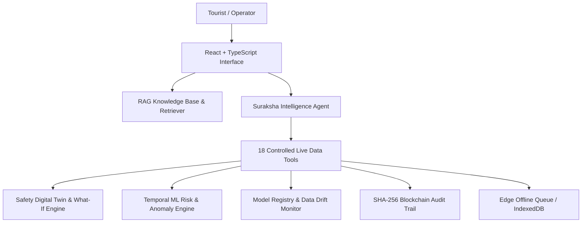

# 🛡️ Suraksha Link — AI Safety Intelligence & Decision Support Platform

<div align="center">


<br/>

**Suraksha Link** is a domain-specialized, offline-first AI Safety Intelligence and Decision Support Platform for India's 36 States and UTs. It features a **Safety Digital Twin**, **RAG Knowledge Base & Retriever**, **18 Live Controlled Data Tools**, **Suraksha Intelligence Grounded Agent**, **Incident Copilot**, **Isolation Forest Anomaly Engine**, **Model Lab & Registry**, **Temporal Risk Forecasting**, and **Blockchain-Anchored Audit Trail**.

[Overview](#-overview) • [Key Features](#-comprehensive-feature-changelog) • [Safety Intelligence Agent](#-ai-safety-intelligence-agent) • [Model Lab & MLOps](#-model-lab--mlops-observatory) • [Digital Twin](#-safety-digital-twin--what-if-simulation-engine) • [Crash Resilience](#-system-crash-fault-tolerance--data-persistence) • [Getting Started](#-getting-started)

---

</div>

## 📌 Table of Contents

- [Overview](#-overview)
- [Comprehensive Feature Changelog](#-comprehensive-feature-changelog)
- [AI Safety Intelligence Agent & RAG Architecture](#-ai-safety-intelligence-agent)
- [Model Lab & MLOps Observatory](#-model-lab--mlops-observatory)
- [Safety Digital Twin & What-If Simulation Engine](#-safety-digital-twin--what-if-simulation-engine)
- [System Crash, Fault Tolerance & Data Persistence](#-system-crash-fault-tolerance--data-persistence)
- [Pan-India 36 State & UT Safety Network](#-pan-india-36-state--ut-safety-network)
- [Tech Stack](#-tech-stack)
- [Getting Started](#-getting-started)
- [License](#-license)

---

## 🌟 Overview

**Suraksha Link** is an end-to-end tourist protection and emergency response decision support platform built for India's 28 States and 8 Union Territories. It connects verified travellers directly with command authorities, field responder units, predictive AI simulation engines, and domain RAG knowledge bases.

The platform provides dual operational viewpoints:
1. **Tourist Portal**: 1-Tap SOS dispatch, Pan-India territory switcher, offline-first geofence alerts, Guardian AI advisory, time-bound live location sharing, emergency contacts directory, and verified Digital Tourist ID.
2. **Authority Command Centre**: Spatial Safety Digital Twin, What-If simulation playground, **Ask Suraksha Intelligence Agent (`/authority/intelligence`)**, **Incident Copilot**, **Model Lab (`/authority/model-lab`)**, Next Best Action (NBA) engine with Human-in-the-Loop (HITL) review, incident replay player, post-incident forensics graph, chaos engineering panel, federated learning monitor, and blockchain audit ledger.

---

## 🚀 Comprehensive Feature Changelog

### 1. 🧠 AI Safety Intelligence & Grounded Reasoning Engine
- **RAG Architecture (`rag-knowledge-base.ts`, `rag-retriever.ts`)**: Structured domain knowledge covering national emergency protocols, state-wise police helplines, digital twin mechanics, system resilience architecture, ML governance policies, and HITL action rules.
- **18 Live Controlled Data Tools (`live-data-tools.ts`)**: High-precision tool execution pipeline fetching empirical telemetry:
  1. `getCurrentRisk(zone)`
  2. `getActiveIncidents()`
  3. `getTouristStatus(touristId)`
  4. `getResponderStatus()`
  5. `getNearbyEmergencyInfrastructure(stateId)`
  6. `getConnectivityStatus()`
  7. `getSafetyCorridors()`
  8. `getCurrentDigitalTwin(params)`
  9. `getIncidentTimeline(incidentId)`
  10. `getIncidentForensics(incidentId)`
  11. `getSystemHealth()`
  12. `getModelHealth()`
  13. `getAuditEvents(incidentId)`
  14. `runWhatIfScenario(parameters)`
  15. `getPanIndiaSafetyData(state)`
  16. `calculateRouteSafety(origin, destination)`
  17. `calculateResilience(zoneName)`
  18. `getIncidentStatistics(timeRange)`
- **8-Step Grounded Reasoning Workflow**: Executes strictly in sequence: `UNDERSTAND` → `RETRIEVE` → `ANALYZE` → `PREDICT` → `EXPLAIN` → `SIMULATE` → `RECOMMEND` → `VERIFY`.
- **Ask Suraksha Assistant Panel (`AskSurakshaPanel.tsx`)**: Interactive multi-turn assistant with response mode selectors (*Quick Answer*, *Detailed Analysis*, *Operational Brief*, *Risk Analysis*, *What-If Analysis*), structured evidence rendering, model confidence scores, data quality levels, and HITL action approval triggers.

### 2. ⚡ Incident Copilot & Executive Operational Briefing
- **Incident Copilot Component (`IncidentCopilot.tsx`)**: Automated executive briefing generator for active incidents detailing location, priority score ($0-100$), assigned responder unit, unresolved operational blockers, audit timeline, grounded evidence sources, and one-click HITL action approvals.

### 3. 🔬 Model Lab & MLOps Observatory (`/authority/model-lab`)
- **Model Comparison Pipeline (`advanced-ml-pipeline.ts`)**: Evaluates and compares Baseline (Random Forest), Advanced (XGBoost v2.1), and Temporal (Spatial Transformer) models.
- **Metrics Evaluation Suite**: Measures Precision, Recall, F1 Score, ROC-AUC, PR-AUC, FPR, FNR, MAE, RMSE, Brier Score, and Inference Latency on held-out validation data.
- **Feature Distribution Drift Monitor (`data-drift-engine.ts`)**: Monitors 30-day feature distribution drift using KS-statistic and Population Stability Index (PSI).
- **Dataset Pipeline Tracking (`dataset-pipeline.ts`)**: Tracks dataset lineage through 7 stages (`RAW` → `VALIDATED` → `CLEANED` → `FEATURE_ENGINEERED` → `TRAIN` → `VALIDATION` → `TEST`) with strict chronological splitting to prevent temporal data leakage.
- **Model Registry (`model-registry.ts`)**: Central repository tracking deployed, candidate, and archived model versions, feature sets, evaluation metrics, and deployment targets.

### 4. 🔮 Safety Digital Twin & What-If Simulation Engine (`/authority/digital-twin`)
- **Live Digital Twin**: Real-time virtual model representing tourists, active incidents, risk zones, responder units, road/route availability, cellular connectivity quality, and zonal resilience scores ($0-100$).
- **What-If Simulation Playground**: Interactive parameters for tourist density, incident spikes, responder availability, road closures, and cellular signal quality.
- **Scenario Delta Visualizer**: Displays real-time delta indicators ($\Delta\text{Risk}$, $\Delta\text{Response Time}$, $\Delta\text{Resilience}$, $\Delta\text{Connectivity}$).
- **Scenario Snapshots Manager**: Save, load, and delete scenario presets (*Monsoon Flash Flood Gridlock*, *Diwali Crowd Surge*, *Cloud Server Outage*).

### 5. 🛡️ System Crash Resilience & Data Provenance
- **UI Crash Resilience Panel**: Explains edge data persistence and fault tolerance.
- **Data Provenance Tagging (`data-provenance.ts`)**: Explicitly tags all system data with provenance categories: `REAL`, `SYNTHETIC`, `SIMULATED`, `USER-GENERATED`, or `MODEL-DERIVED`.
- **Edge Storage Persistence**: Retains unsynced SOS alerts in LocalStorage/IndexedDB during offline or crash events; auto-synchronizes on reconnect.
- **Solidity/EVM Blockchain Audit**: SHA-256 cryptographic hashes anchored into an immutable append-only audit ledger.

### 6. 🌐 Pan-India 36 State & UT Safety Network (`/pan-india`)
- Complete emergency directory for all 28 States and 8 Union Territories with state-specific police, tourist police, women helpline (1091/181), ambulance (108), disaster management, advisories, and Do's & Don'ts.

---

## 🏗️ System Architecture



---

## 🛠️ Tech Stack

- **Frontend**: React 18, TypeScript, TailwindCSS, Lucide Icons, Wouter Router, Sonner Toasts
- **State & Context**: SafetyContext (React Context API + LocalStorage persistence)
- **AI & Reasoning Engine**: RAG Retriever + Grounded 8-Step Reasoning Agent Core
- **ML & Data Pipeline**: XGBoost/Random Forest model comparison, Isolation Forest anomaly pipeline, KS/PSI drift engine, temporal lag features
- **Geospatial & Twin**: Custom spatial digital twin calculator & What-If delta simulator
- **Audit & Edge**: Cryptographic SHA-256 audit ledger, LocalStorage/IndexedDB offline queue

---

## ⚡ Getting Started

### 1. Installation
```bash
git clone https://github.com/Adithya2005-spec/smart-tourist-safety.git
cd smart-tourist-safety
pnpm install
```

### 2. Run Development Server
```bash
pnpm run dev
```
Open `http://localhost:3000` in your browser.

### 3. Build for Production
```bash
pnpm run build
```

---

## 📜 License

### 1. Safety Digital Twin & What-If Simulation Engine
1. Select **Command Responder** role from the top-right role switcher.
2. Navigate to **Digital Twin & Simulator** from the sidebar (`/authority/digital-twin`).
3. Under **Live Twin State**, toggle map layer switches (*Heatmap*, *Responders*, *Incidents*, *Infrastructure*, *Connectivity*).
4. Switch to **What-If Simulation**:
   - Drag **Tourist Density Multiplier** to `2.5x`
   - Increase **Incident Spike Multiplier** to `3.0x`
   - Lower **Responder Availability** to `50%`
5. Observe real-time predicted response delays ($\Delta\text{Response Time}$), risk score changes ($\Delta\text{Risk}$), and pre-positioning recommendations.
6. Click **Save Preset** to save the custom scenario snapshot.
7. Switch to **System Crash & Fault Tolerance** to review edge persistence, offline queue recovery, and blockchain audit integrity details.

### 2. Pan-India 36 Territory Switcher
1. Click the **Active Territory** dropdown in the top bar or sidebar.
2. Select **Goa (GA)** or **Ladakh (LA)**.
3. Observe how emergency helplines, police contact numbers, advisories, do's & don'ts, and local risk zones dynamically update across the entire portal.

### 3. Next Best Action & Human-in-the-Loop Review
1. Navigate to **Command Centre** (`/authority`).
2. View **Next Best Action Engine** recommendations.
3. Click **Review & Approve** on a pending recommendation to launch the **HitlDecisionModal**.
4. Enter approval rationale notes and click **Approve Action**.

### 4. Incident Replay & Chaos Simulator
1. Click **Replay Incident Lifecycle** on the Command Centre page to launch the interactive playback player.
2. Toggle cloud outage or responder unavailability in the **Chaos Simulator Panel** to evaluate real-time resilience responses.

### 5. Tourist Safety Portal & Offline SOS
1. Switch role to **Tourist View**.
2. Go to **SOS Centre** $\rightarrow$ Click **Emergency SOS**.
3. Toggle connection to **Go Offline** in the header to observe the local edge queue holding the SOS alert safely until connection is restored.

---

## 📄 License

MIT License © 2026 — Adithya & Team

<div align="center">
  Built with ❤️ for Smart Tourist Safety & Resilience
</div>
