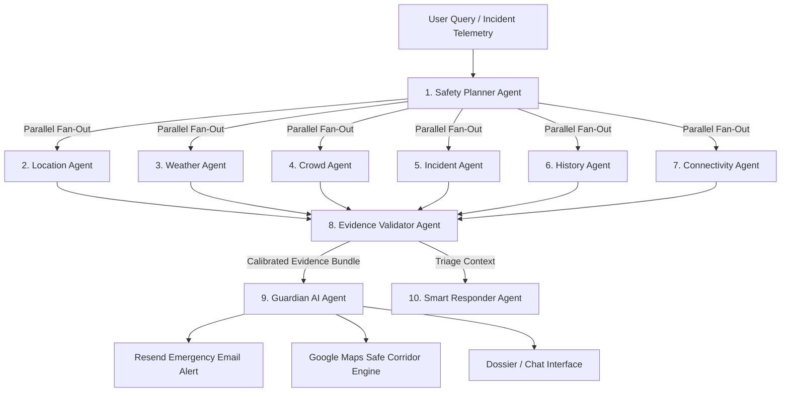
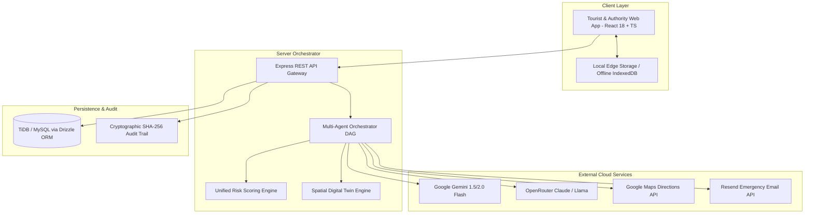

# 🛡️ Suraksha Link — Multi-Agent AI Safety Intelligence & Decision Support Platform

<div align="center">


<br/>

**Suraksha Link** is an end-to-end, domain-specialized, offline-first AI Safety Intelligence and Emergency Decision Support Platform built for India's 28 States and 8 Union Territories. It combines an **Orchestrated Multi-Agent System (Planner, Location, Weather, Crowd, Incident, History, Connectivity, Evidence Validator, Guardian AI, Responder)**, **Dual-Engine LLMs (Google Gemini + OpenRouter)**, **Safety Digital Twin & What-If Simulator**, **Automated Resend Alerts**, **Google Maps GIS Safe Corridors**, **RAG Domain Knowledge Base**, and **Blockchain-Anchored Immutable Audit Trails**.

[Overview](#-overview) • [Multi-Agent Architecture](#-multi-agent-safety-intelligence-system) • [Key Features](#-comprehensive-feature-changelog) • [API Integrations](#-api-integrations--llm-engines) • [System Architecture](#-system-architecture) • [Getting Started](#-getting-started) • [Tour of Features](#-hands-on-walkthrough--testing-guide)

---

</div>

## 📌 Table of Contents

- [Overview](#-overview)
- [Multi-Agent Safety Intelligence System](#-multi-agent-safety-intelligence-system)
- [Dual-LLM & External API Integrations](#-api-integrations--llm-engines)
- [Comprehensive Feature Changelog](#-comprehensive-feature-changelog)
  - [1. Orchestrated Multi-Agent Core](#1--orchestrated-multi-agent-safety-core)
  - [2. Guardian AI Multilingual Decision Assistant](#2--guardian-ai-multilingual-safety-copilot-touristguardian-ai)
  - [3. Unified Safety Intelligence Dossier](#3--unified-safety-intelligence-dossier-touristdossier)
  - [4. Safe Route Corridors & Google Maps Routing](#4--google-maps-gis-safe-corridors-service)
  - [5. Automated Resend Emergency Alert Dispatches](#5--resend-automated-emergency-alert-service)
  - [6. Spatial Safety Digital Twin & What-If Simulator](#6--spatial-safety-digital-twin--what-if-simulation-engine)
  - [7. MLOps Observatory, Model Lab & Drift Detection](#7--model-lab--mlops-observatory-authoritymodel-lab)
  - [8. Edge Storage & Cryptographic Blockchain Audit](#8--offline-edge-storage--sha-256-blockchain-audit)
  - [9. Pan-India 36 State & UT Safety Directory](#9--pan-india-36-state--ut-safety-network-pan-india)
- [System Architecture](#-system-architecture)
- [Tech Stack](#-tech-stack)
- [Environment Variables](#-environment-variables)
- [Getting Started & Build Commands](#-getting-started)
- [Hands-On Walkthrough & Testing Guide](#-hands-on-walkthrough--testing-guide)
- [License](#-license)

---

## 🌟 Overview

**Suraksha Link** delivers proactive tourist protection and rapid emergency response across all of India. It bridges verified travelers, regional tourist police forces, state disaster management authorities, and automated multi-agent AI systems into a unified operational platform.

The application serves two synchronized personas:
1. **Tourist View (`/tourist`)**:
   - 1-Tap SOS dispatch with offline IndexedDB/LocalStorage queueing.
   - **Guardian AI (`/tourist/guardian-ai`)**: Conversational safety copilot in English, Hindi (हिंदी), and Kannada (ಕನ್ನಡ) with dynamic suggestions.
   - **Unified Safety Dossier (`/tourist/dossier`)**: Live risk breakdown, active hazard proximity, safe evacuation routes, and instant alert dispatch.
   - Pan-India 36 territory switcher dynamically loading state-level laws, official police helplines, and dynamic geofences.
   - Digital Tourist ID with cryptographically verifiable QR code.
   - Time-bound live GPS sharing and offline emergency contacts directory.
2. **Authority Command Centre (`/authority`)**:
   - Real-time Spatial Safety Digital Twin with multi-layer overlays (*Heatmap, Responders, Incidents, Connectivity*).
   - What-If simulation engine with interactive scenario stress-testing.
   - **Incident Queue (`/authority/incidents`)**: Automated triage, priority scoring ($0-100$), and responder dispatch.
   - Next Best Action (NBA) engine with Human-in-the-Loop (HITL) review modal.
   - Post-incident forensics causal graphs and incident replay timeline player.
   - Model Lab (`/authority/model-lab`) and MLOps feature drift monitoring.

---

## 🤖 Multi-Agent Safety Intelligence System

The platform is orchestrated by an asynchronous Multi-Agent Directed Acyclic Graph (DAG) running on Node.js/Express:



### Specialist Agent Breakdown:
| Agent | Role & Telemetry Extracted | Execution Mode |
|---|---|---|
| **`planner-agent.ts`** | NLP intent classification, priority grading, and task DAG construction | Sequential (Entrypoint) |
| **`location-agent.ts`** | Geofence proximity, boundary hazards, tourist corridor classification | Parallel Sensor |
| **`weather-agent.ts`** | Rainfall (mm), wind speed, flood risk, AWS sensor anomaly evaluation | Parallel Sensor |
| **`crowd-agent.ts`** | Density index, footfall surge velocity, choke point detection | Parallel Sensor |
| **`incident-agent.ts`** | Active cluster count, severity weighting, resolution time tracking | Parallel Sensor |
| **`history-agent.ts`** | Historical crime rates, multi-year trend patterns per zone | Parallel Sensor |
| **`connectivity-agent.ts`**| Cellular strength (dBm), offline status, edge queue synchronization | Parallel Sensor |
| **`evidence-validator.ts`**| Freshness checks, multi-source agreement, confidence calibration | Sequential Evaluator |
| **`guardian-ai.ts`** | Multilingual reasoning (Gemini/OpenRouter) + deterministic rule fallback | Context Synthesizer |
| **`responder-agent.ts`** | Haversine proximity, skill matching, unit load balancing, ETA | Action Allocator |

---

## 🔑 API Integrations & LLM Engines

Suraksha Link is architected with a resilient multi-tier fallback mechanism:

### 1. Google Gemini AI Service (`server/services/gemini.ts`)
- Connects directly to Google Generative Language REST API (`gemini-1.5-flash`).
- Provides ultra-fast context-aware reasoning with native multilingual fluency in Hindi, Kannada, and English.
- Evaluates real-time incident descriptions, analyzes risk factors, and outputs structured action recommendations with confidence scoring.

### 2. OpenRouter LLM Gateway (`server/services/openrouter.ts`)
- Secondary LLM gateway configured with `anthropic/claude-3.5-haiku` and `meta-llama/llama-3.3-70b-instruct`.
- Automatically activates if primary Gemini encounters quota limits or network disruption.

### 3. Google Maps GIS Service (`server/services/maps.ts`)
- Computes turn-by-turn routes between GPS coordinates with walking and transit modes.
- Evaluates each route waypoint against dynamic high-risk geofences to score segment safety and recommend lower-risk detours.

### 4. Resend Emergency Email Dispatches (`server/services/resend-alerts.ts`)
- Delivers real-time emergency notifications to authorities and family contacts.
- Includes formatted incident tables, severity banners, GPS coordinates, and direct Google Maps links with a 15-minute anti-spam deduplication window.

### 5. Zero-Dependency Deterministic Fallback
- If all cloud APIs are offline or unconfigured, the platform seamlessly operates on a high-reliability deterministic local rules engine, ensuring zero downtime in critical situations.

---

## 🚀 Comprehensive Feature Changelog

### 1. 🧠 Orchestrated Multi-Agent Safety Core
- **Execution DAG API (`POST /api/agent/query`)**: Executes parallel sensor agents, feeds outputs into the Evidence Validator, computes risk score ($0-100$), and returns calibrated intelligence.
- **Planner Endpoint (`POST /api/agent/plan`)**: Standalone route for inspecting agent DAG assignments.
- **Evidence Verification**: Validates telemetry freshness (<60s = fresh, <300s = acceptable, >300s = stale) and assigns confidence ratings ($0-100\%$).

### 2. 🛡️ Guardian AI Multilingual Safety Copilot (`/tourist/guardian-ai`)
- Dedicated conversational safety page with live suggested queries.
- Instant language switching between **English**, **Hindi (हिंदी)**, and **Kannada (ಕನ್ನಡ)**.
- Visual execution trace drawer showing real-time specialist agent status.
- Key safety tips and actionable emergency directives.

### 3. 📋 Unified Safety Intelligence Dossier (`/tourist/dossier`)
- Single-pane-of-glass dossier summarizing tourist status, location context, and dynamic danger zones.
- Embedded **Risk Forecast Chart** with temporal 24-hour predictive trend analysis.
- Multi-agent evidence bundle viewer showing individual agent telemetry.
- One-click emergency escalation button triggering Resend email alerts.

### 4. 🗺️ Google Maps GIS Safe Corridors Service
- Intelligent pathway comparison showing shortest direct route vs. verified safer perimeter corridor.
- Waypoint-level risk scoring avoiding high-density hazard pockets.

### 5. 📧 Resend Automated Emergency Alert & Anti-Spam Service
- **Real-Time Dispatch**: Dispatches HTML formatted emergency directives with interactive Google Maps links to control rooms (`safety-control@suraksha.gov.in`) and designated family contacts.
- **15-Minute Anti-Spam Deduplication Engine**: In-memory deduplication window (`DEDUPLICATION_WINDOW_MS = 15 * 60 * 1000`) prevents alert flooding for the same incident ID (`INC-XXXX`).
- **Critical Escalation Bypass**: If an incident status escalates to `CRITICAL` from any lower tier, the deduplication lock is immediately bypassed to ensure responder safety.
- **Audit & Status Tracking**: Query dispatch timing and rate-limiting status in real-time via `GET /api/alerts/status/:incidentId`.
- **Safe Fallback**: Operates in simulated audit mode if `RESEND_API_KEY` is absent, guaranteeing system resilience.

### 6. 🔮 Spatial Safety Digital Twin & What-If Simulation Engine (`/authority/digital-twin`)
- Real-time virtual model representing tourists, active incidents, risk zones, responder units, and connectivity.
- Interactive simulation sliders for tourist density ($0.5x-3x$), incident surges ($0.5x-4x$), and responder availability ($20\%-100\%$).
- Real-time delta visualizers ($\Delta\text{Risk}$, $\Delta\text{Response Time}$, $\Delta\text{Resilience}$).
- Preset snapshots (*Monsoon Flash Flood Gridlock*, *Diwali Crowd Surge*, *Cloud Outage*).

### 7. 🔬 Model Lab & MLOps Observatory (`/authority/model-lab`)
- Comparison pipeline benchmarking Random Forest, XGBoost v2.1, and Spatial Transformer.
- Metrics evaluation: Precision, Recall, F1, ROC-AUC, PR-AUC, FPR, FNR, MAE, RMSE, and Brier Score.
- 30-day feature distribution drift monitoring using KS-statistic and Population Stability Index (PSI).
- Dataset lineage tracker with chronological train/validation/test splitting.

### 8. 🛡️ Offline Edge Storage & SHA-256 Blockchain Audit
- Unsynced SOS alerts stored safely in LocalStorage/IndexedDB during network drops; automatically synced on reconnect.
- Cryptographic SHA-256 audit ledger with chained hashes verifying log integrity.

### 9. 🌐 Pan-India 36 State & UT Safety Network (`/pan-india`)
- Complete directory for all 28 States and 8 Union Territories with state police, tourist police, women helpline (1091/181), ambulance (108), disaster management, and regional travel advisories.

### 10. 📊 Real Data Schema Templates (`/data_templates`)
Pre-structured, schema-validated templates aligned with official Indian Open Government Data (data.gov.in) and Ministry of Tourism portals:
- **`drift_baseline.csv` & `drift_current.csv`**: Feature baselines for KS-test and PSI drift validation.
- **`isolation_tourism_anomaly.csv`**: Features for unsupervised anomaly detection in tourist corridors.
- **`temporal_tourism_forecasting.csv`**: Time-series historical hourly visitor volumes for predictive risk modelling.
- **`xgboost_incident_risk.csv` & `random_forest_risk.csv`**: Supervised classification features for safety risk grading.
- **`responder_allocation.csv`**: Unit dispatch latency and route efficiency operational schemas.
- **`guardian_finetuning_example.jsonl`**: Domain-specialized instruction datasets for safety copilot fine-tuning.

---

## 🏗️ System Architecture



---

## 🛠️ Tech Stack

- **Frontend**: React 18, TypeScript, TailwindCSS v4, Lucide Icons, Wouter Router, Sonner Toasts
- **State & Storage**: SafetyContext (React Context API) + LocalStorage/IndexedDB offline persistence
- **Backend**: Node.js, Express, tsx
- **AI & Reasoning**: Google Gemini API, OpenRouter LLM Gateway, Domain RAG Retriever
- **Geospatial & Safe Routing**: Google Maps API, Haversine spatial calculation engine
- **Communications**: Resend API (Emergency dispatch notifications)
- **Database & ORM**: Drizzle ORM (MySQL / TiDB)
- **Testing & Verification**: Vitest (9 test suites, 26 unit tests)

---

## 📡 REST API Reference

| Method | Endpoint | Description | Payload Example |
|---|---|---|---|
| `POST` | `/api/agent/query` | Executes orchestrated multi-agent DAG evaluation | `{"query": "Is Cubbon Park safe tonight?", "language": "en"}` |
| `POST` | `/api/agent/plan` | Inspects agent dynamic task planner breakdown | `{"query": "Check weather and crowd near MG Road"}` |
| `POST` | `/api/guardian/ask` | High-speed Guardian conversational safety endpoint | `{"query": "Emergency contacts in Karnataka", "language": "kn"}` |
| `POST` | `/api/risk/evaluate` | Unified risk index score calculation ($0-100$) | `{"stateId": "KA", "location": {"lat": 12.97, "lng": 77.59}}` |
| `GET` | `/api/routes/safe` | Compares direct vs. perimeter safe corridors | *(None)* |
| `POST` | `/api/alerts/dispatch` | Dispatches Resend emergency email notifications | `{"incidentId": "INC-4500", "severity": "CRITICAL", "incidentType": "Medical"}` |
| `GET` | `/api/alerts/status/:id`| Checks incident deduplication & rate-limit status | `GET /api/alerts/status/INC-4500` |
| `POST` | `/api/simulation/what-if`| Stress-tests environmental & crowd escalation scenarios | `{"rainfallShiftMm": 50, "crowdMultiplier": 2.5}` |
| `GET` | `/api/agent/runs` | Fetches audit log of recent multi-agent runs | *(None)* |

---

## 🔐 Environment Variables

Create a `.env` file in the root directory (see `.env.example`):

```env
# Application Port
PORT=3000
NODE_ENV=development
JWT_SECRET="suraksha_local_development_secret_key"
VITE_APP_ID="suraksha-link"

# Google Gemini AI Key
GEMINI_API_KEY="your-gemini-api-key"

# OpenRouter LLM Key (Optional secondary gateway)
OPENROUTER_API_KEY="your-openrouter-key"
OPENROUTER_MODEL="anthropic/claude-3.5-haiku"

# Google Maps API Key (Optional real routing)
GOOGLE_MAPS_API_KEY="your-google-maps-key"
VITE_GOOGLE_MAPS_API_KEY="your-google-maps-key"

# Resend Alerts API Key (Optional email dispatches)
RESEND_API_KEY="your-resend-api-key"
RESEND_FROM_EMAIL="onboarding@resend.dev"
EMERGENCY_DISPATCH_EMAIL="safety-control@suraksha.gov.in"
```

---

## ⚡ Getting Started

### 1. Clone & Install
```bash
git clone https://github.com/Adithya2005-spec/smart-tourist-safety.git
cd smart-tourist-safety
npm install
```

### 2. Run All Tests
```bash
npm test
```
*Executes all 26 unit tests across the 9 test suites in `vitest`.*

### 3. Check TypeScript
```bash
npm run check
```
*Validates full codebase types with `tsc --noEmit`.*

### 4. Run Development Server
```bash
npm run dev
```
*Starts application at `http://localhost:3000`.*

### 5. Build for Production
```bash
npm run build
```
*Bundles client assets into `dist/public` and compiles server into `dist/index.js`.*

---

## 🧪 Hands-On Walkthrough & Testing Guide

### 1. Tourist Experience
1. Navigate to `/tourist` for the **Safety Overview**.
2. Click **Guardian AI (Multi-Agent)** (`/tourist/guardian-ai`):
   - Switch language to **हिंदी** or **ಕನ್ನಡ**.
   - Send queries like *"Is Cubbon Park safe tonight?"* or *"What should I do in an emergency?"*.
   - View the active **Agent Execution Drawer** showing telemetry from Location, Weather, and Crowd agents.
3. Open **Safety Dossier** (`/tourist/dossier`):
   - Inspect the **Risk Forecast Chart** and **Specialist Evidence Bundle**.
   - Click **Trigger Emergency Alert** to dispatch an automated notification via Resend.
4. Open **SOS Centre** (`/tourist/sos`):
   - Toggle **Go Offline** in the header and trigger an emergency SOS.
   - Observe how the local edge queue safely retains the alert until connectivity resumes.

### 2. Authority Command Experience
1. Switch role to **Command Responder** and navigate to `/authority`.
2. Inspect the **Safety Dossier Card** on the command dashboard.
3. Open **Digital Twin & Simulator** (`/authority/digital-twin`):
   - Adjust the **What-If Simulation** sliders to stress-test high crowd surges and severe weather scenarios.
4. Review active incidents in the **Incident Queue** (`/authority/incidents`) and approve recommendations in the **HITL Decision Modal**.
5. Check **Model Lab & MLOps** (`/authority/model-lab`) to view model comparison benchmarks and feature drift scores.

---

## 📄 License

MIT License © 2026 — Adithya & Team  
*Built for the Smart India Hackathon (SIH 2026) — Smart Tourist Safety & Resilience.*
